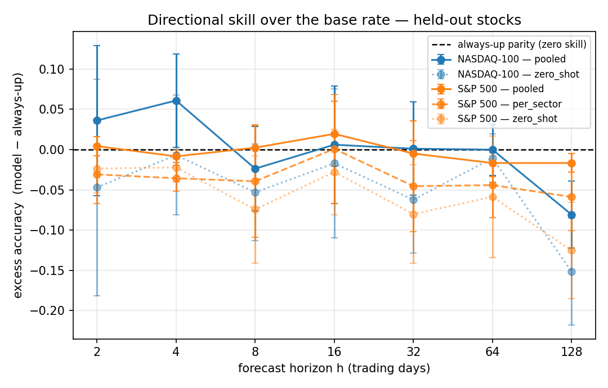

# When Directional Accuracy Lies

**A base-rate-honest benchmark for LoRA-adapted TimesFM on equity forecasting**

📄 Paper: [arXiv:2607.12248](https://arxiv.org/abs/2607.12248) ([HTML](https://arxiv.org/html/2607.12248v1) · [local PDF](paper/When_Directional_Accuracy_Lies__A_Base_Rate_Honest_Benchmark_for_LoRA_Adapted_TimesFM_on_Equity_Forecasting_.pdf) · [LaTeX source](paper/paper.tex)) ·
🧪 Lab log: [`paper/EXPERIMENT_LOG.md`](paper/EXPERIMENT_LOG.md) ·
📊 Committed results: [`results/`](results/)

An early LoRA fine-tune of [TimesFM 2.5](https://github.com/google-research/timesfm) in this
project appeared to reach **~80% directional accuracy** on equities. This repository contains
the benchmark built to interrogate that number — and the replicated, honest **negative result**
it produced: the 80% was the equity uptrend, not skill. In a rising market, a rule that always
predicts "up" scores just as high without looking at the input, so raw directional accuracy is
the wrong scoreboard. The right one is **excess accuracy over the always-up base rate on
identical windows** — and on that scoreboard, fine-tuned TimesFM has none.

## Findings

1. **The ~80% was a base-rate artifact.** Recreating the original condition (pooled adapter,
   2014+ bull training window, raw accuracy) yields an always-up base rate of **0.704** at the
   six-month horizon on held-out stocks — and the fine-tuned model scores **0.626**, _below_ it.
2. **No directional skill over the base rate, replicated on two universes.** On an honest
   walk-forward benchmark, excess accuracy is centred on zero at every horizon and **negative at
   h=128** on both NASDAQ-100 (−0.081) and S&P 500 (−0.017). Zero-shot TimesFM is below the base
   rate everywhere.
3. **Per-sector specialization is significantly _worse_ than one pooled adapter** — the
   pre-registered confirmatory test. On held-out S&P 500 stocks at h=128, per-sector accuracy is
   0.599 vs pooled 0.641, and Diebold–Mariano rejects equality in pooling's favour (p < 0.001 in
   folds 0 and 2).
4. **Fine-tuning's only measurable benefit is point error, and it doesn't matter.** Pooled LoRA
   beats zero-shot on held-out MAE (15.15 vs 16.31 on S&P 500; 25.15 vs 26.44 on NASDAQ-100,
   significant under Diebold–Mariano with FDR control) — but does not beat the naive always-up
   forecast (15.56 / 24.91), and the quantile tails stay badly miscalibrated (nominal 0.05
   quantile ≈ 0.44 empirical coverage for both models).



**Excess accuracy** (model − always-up, held-out stocks, fold-averaged) — positive would mean
skill over the base rate:

| h                        | 2      | 4      | 8      | 16     | 32     | 64     | 128        |
| ------------------------ | ------ | ------ | ------ | ------ | ------ | ------ | ---------- |
| **NASDAQ-100** pooled    | +0.036 | +0.061 | −0.024 | +0.006 | +0.001 | −0.000 | **−0.081** |
| **NASDAQ-100** zero-shot | −0.047 | −0.007 | −0.053 | −0.017 | −0.062 | −0.011 | −0.151     |
| **S&P 500** pooled       | +0.004 | −0.009 | +0.002 | +0.019 | −0.005 | −0.017 | **−0.017** |
| **S&P 500** per-sector   | −0.031 | −0.036 | −0.039 | +0.001 | −0.045 | −0.044 | −0.059     |
| **S&P 500** zero-shot    | −0.024 | −0.022 | −0.074 | −0.028 | −0.080 | −0.059 | −0.125     |

Every cell above is reproducible from the committed [`results/**/raw.json`](results/) files.
(McNemar rejections that survive FDR indicate the model _differs from_ — often underperforms —
the base rate; h=128 is underpowered and no significance is claimed there. See paper §Results.)

## Method at a glance

- **Frozen, checksum-verified data.** Each universe (S&P 500: 501 stocks + 11 SPDR ETFs;
  NASDAQ-100: 100 stocks + QQQ; daily adjusted close, 2005–2026) is frozen once into a
  versioned artifact under [`data/frozen/`](data/frozen/) and reused by every run.
- **Expanding walk-forward folds** — validation is the _only_ early-stopping/model-selection
  signal; the test window is never used for selection:

  | Fold | Train     | Validation | Test      |
  | ---- | --------- | ---------- | --------- |
  | 0    | 2005–2019 | 2019–2020  | 2020–2022 |
  | 1    | 2005–2021 | 2021–2022  | 2022–2024 |
  | 2    | 2005–2023 | 2023–2024  | 2024–2026 |

- **Held-out tickers.** Per-sector 80/20 seen/held-out split (seed 42, fixed across folds);
  held-out names are never trained in any fold. Headline numbers are on held-out stocks.
- **Leakage-controlled normalization.** Per-series log + z-score fit only on pre-target
  history; returns and point error use inverse-transformed prices.
- **Honest baselines.** Always-up (the base rate), random-walk, persistence, AR(1), and
  zero-shot TimesFM (served from a dedicated instance with an assertion that adapter loading
  cannot mutate it).
- **Paired significance.** McNemar + block-bootstrap CIs for excess accuracy; Diebold–Mariano
  (Newey–West, sample-size-capped lag) for forecast error; Benjamini–Hochberg FDR across the
  exploratory family.
- **Seeded end to end.** Seed 42 across Python/NumPy/torch/CUDA, set _before_ LoRA
  initialization, with a seeded DataLoader; the best-validation checkpoint is what gets scored.
  A reproducibility gate runs the smoke benchmark twice and asserts bit-identical accuracies
  before the real runs. Every run writes a `run_meta.json` (seed, git commit + clean-tree flag,
  GPU, versions, full pip freeze, per-adapter best epoch).

Training configuration (identical across universes and methods): TimesFM 2.5 200M, LoRA
r=32/α=64/dropout 0.05, context 512 / horizon 128, batch 512, AdamW lr 1e-4 wd 0.01, cosine
warm restarts, MSE + 0.3·directional loss, max 80 epochs (patience 15, min 30), seed 42.

## Repository layout

```
paper/                  paper.tex, compiled PDF, figures/, EXPERIMENT_LOG.md (full lab log)
results/                committed outputs backing every number in the paper
  benchmark/<version>/    raw.json + run_meta.json + tables.md  (S&P 500, NASDAQ-100)
  legacy/<version>/       the recreated ~80% condition (raw.json + run_meta.json)
finetune/               benchmark pipeline: data_frozen, splits, metrics, benchmark,
                        run_benchmark, trainer, model_setup, loss, config, data_prep, data_collector
scripts/                freeze_data.py, render_tables.py, make_figures.py
notebooks/              reproduce_all_colab.ipynb — the one canonical reproduction notebook
data/frozen/            versioned frozen price artifacts (checksums in universe.json)
simofi/                 universe/sector catalog (source of NASDAQ-100 membership)
tests/                  55 CPU tests (splits, metrics, baselines, data loading, rendering, repro)
```

## Reproducing the paper

**0. Inspect the committed results (no compute).** Every table and figure derives from
`results/**/raw.json`. Provenance for all three runs (`run_meta.json`): development-repo commit
`703f181`, clean tree, seed 42, NVIDIA A100, torch 2.11.0+cu128, Python 3.12.

**1. Verify the CPU-testable machinery (~1 min).**

```bash
pip install -r requirements.txt   # CPU torch is fine for this step
python -m pytest                  # 55 passed
```

**2. Re-render tables and figures from the committed results (CPU).**

```bash
python -m scripts.render_tables --version sp500_2005-01-01_2026-01-01_f2026-06-04
python -m scripts.render_tables --version nasdaq100_2005-01-01_2026-01-01_f2026-06-16
python -m scripts.make_figures --out paper/figures \
    "NASDAQ-100=results/benchmark/nasdaq100_2005-01-01_2026-01-01_f2026-06-16/raw.json" \
    "S&P 500=results/benchmark/sp500_2005-01-01_2026-01-01_f2026-06-04/raw.json"
```

**3. Full reruns (one A100, e.g. Colab).** Open
[`notebooks/reproduce_all_colab.ipynb`](notebooks/reproduce_all_colab.ipynb). It clones this
repo, installs dependencies, runs the reproducibility gate, then trains **and** honestly tests
all three methods from scratch: the legacy ~80% recreation, the per-sector + pooled S&P 500
benchmark, and the pooled NASDAQ-100 benchmark. Equivalently, from a GPU shell:

```bash
python -m finetune.run_benchmark --smoke                                   # fast sanity pass
python -m finetune.run_benchmark --version sp500_2005-01-01_2026-01-01_f2026-06-04
python -m finetune.run_benchmark --version nasdaq100_2005-01-01_2026-01-01_f2026-06-16 --pooled-only
```

Results are single-seed deterministic up to ~1e-3 GPU-atomic jitter
(`torch.use_deterministic_algorithms` raises on TimesFM kernels).

**4. Re-freeze data from scratch (optional).** `python -m scripts.freeze_data --universe sp500`
(or `nasdaq100`). Note a fresh freeze downloads current Yahoo data and produces a _new_
versioned artifact — the committed artifacts are the canonical ones for the paper's numbers.

## Data notes

Prices are split/dividend-adjusted daily closes fetched via yfinance at freeze time and stored
with per-ticker sha256 checksums; the loader verifies integrity. NASDAQ-100 membership and
sector tags come from the `simofi` catalog; both universes share one sector taxonomy. The
frozen data are included solely for research reproducibility.

**Survivorship caveat (important):** both universes are _current-membership snapshots_, not
point-in-time constituents. Only 2005–2026 survivors are included, which inflates the up base
rate and long-horizon drift. Results are a benchmark over a frozen current-constituent
universe, not a live investable simulation.

## Limitations

Condensed from the paper: h=128 directional tests are severely underpowered (few discordant
pairs per fold — reported, never claimed significant); survivorship bias as above; the
NASDAQ-vs-S&P comparison is exploratory and confounded (size, sector mix, price level);
single-seed determinism, not multi-seed robustness; non-overlapping windows under-sample short
horizons; equities + sector ETFs only.

## Project history

This work began as per-asset-class LoRA fine-tuning (equity/forex/macro) of TimesFM 2.5 for a
trading application; that phase produced the ~80% claim this paper debunks — the condition is
recreated honestly in the paper's Results and in [`results/legacy/`](results/legacy/). This
repository is the publication artifact; the full development history (superseded notebooks,
one-off fix scripts, and the original adapters) is preserved in the private development
repository, and `paper/EXPERIMENT_LOG.md` documents every methodological decision along the way.

## Citation

```bibtex
@misc{cheung2026directional,
  title         = {When Directional Accuracy Lies: A Base-Rate-Honest Benchmark for
                   LoRA-Adapted TimesFM on Equity Forecasting},
  author        = {Cheung, Taizhen},
  year          = {2026},
  eprint        = {2607.12248},
  archivePrefix = {arXiv},
  primaryClass  = {q-fin.ST},
  url           = {https://arxiv.org/abs/2607.12248}
}
```

## License

Code, paper, and results are released under the [MIT License](LICENSE). The TimesFM base
model, its weights, and upstream data sources are governed by their own licenses and terms.

## Key references

- Das et al., _A decoder-only foundation model for time-series forecasting_ (TimesFM), ICML 2024
- Hu et al., _LoRA: Low-Rank Adaptation of Large Language Models_, 2021
- Fu, Hirano & Imajo, _Financial Fine-tuning a Large Time Series Model_, arXiv:2412.09880 —
  the ≈54% short-horizon directional ceiling that made an 80% claim suspect
- Diebold & Mariano (1995); McNemar (1947); Künsch (1989); Benjamini & Hochberg (1995) —
  the significance machinery
